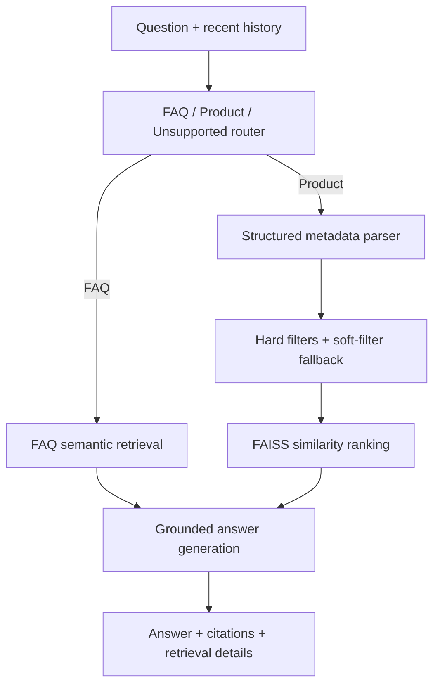

# Fashion RAG Assistant

合成ファッション商品カタログと店舗 FAQ を対象に、検索根拠を確認できる RAG アシスタントです。メタデータ制約、FAISS 検索、引用検証、評価パイプラインを一つの再現可能なデモにまとめています。


[](https://github.com/eeeewyz/fashion-rag-assistant/actions/workflows/tests.yml)

An explainable, portfolio-ready RAG system that routes store-policy and
fashion-product questions, retrieves traceable evidence, and prevents generated
answers from citing records outside that evidence.

## Problem

Pure vector search can return semantically similar products that violate exact
requirements such as price, color, or product type. A useful shopping assistant
also needs a separate path for policy questions and enough visibility to explain
why each result was selected.

This project combines:

- semantic FAQ retrieval for policy questions;
- structured query parsing for product requests;
- metadata filtering before FAISS similarity ranking;
- deterministic soft-filter fallback while preserving hard constraints; and
- grounded generation with canonical FAQ and product IDs.

## Architecture



## Key features

- **Strict structured boundaries:** Pydantic models validate routes, filters,
  provider responses, products, FAQs, and public pipeline outputs.
- **Hybrid product retrieval:** exact metadata constraints reduce the candidate
  set before normalized embeddings are ranked with FAISS.
- **Auditable fallback:** `usage → season → color → gender` can be relaxed when
  necessary; price and article type remain hard constraints.
- **Evidence-preserving answers:** generated citations are normalized and
  checked against retrieved IDs, with one constrained retry on grounding
  failure.
- **Explainable UI:** the Gradio interface shows route, task nature, applied
  filters, latency, similarity scores, IDs, and relaxed filters.
- **Evaluation-ready:** a fixed 30-case dataset measures routing, metadata
  parsing, retrieval, constraint compliance, groundedness, and latency.
- **Offline tests:** provider and embedding doubles keep automated tests
  deterministic and independent of API secrets or model downloads.

## Evaluation

No measured result table is published yet because the complete live evaluation
has not been run successfully. The repository does not substitute test fixtures
or estimated numbers for provider-backed measurements.

After configuring the API key, run all 30 labeled cases:

```bash
export TOGETHER_API_KEY="your-key"
python -m evaluation.run_evaluation
```

The command writes `evaluation/results.json` and `evaluation/results.md` only
after every case completes. Review both artifacts before publishing their
baseline-versus-improved table. The clean exploration notebook will display the
same verified results after it is regenerated:

```bash
python scripts/create_notebook.py
```

## Local setup

```bash
git clone https://github.com/eeeewyz/fashion-rag-assistant.git
cd fashion-rag-assistant
python3.11 -m venv .venv
source .venv/bin/activate
python -m pip install -r requirements.txt
export TOGETHER_API_KEY="your-key"
python app.py
```

Run the deterministic test suite with:

```bash
python -m pip install -r requirements-dev.txt
python -m pytest -q
```

The first application start downloads the configured sentence-transformer
embedding model.

## Hugging Face deployment

1. Create a new **Gradio** Hugging Face Space.
2. Upload or connect this repository so `app.py` is the Space entry point.
3. In **Settings → Variables and secrets**, add `TOGETHER_API_KEY` as a Secret.
4. Optionally set `TOGETHER_MODEL`, `EMBEDDING_MODEL`, `TOP_K`, or
   `MAX_HISTORY_TURNS` as Space variables.
5. Restart the Space and inspect its build log before sharing the URL.

Never commit the API key to the repository, notebook, Space files, or a
screenshot.

## Limitations and future work

- The catalog is deliberately small and synthetic, so it does not model live
  inventory, regional availability, customer profiles, or changing prices.
- Routing, parsing, and grounded generation depend on an external LLM provider;
  latency and output quality can change with the selected model.
- The current retriever is English-focused and does not evaluate multilingual
  or typo-heavy queries.
- Soft-filter relaxation uses a fixed business rule rather than a learned or
  user-confirmed preference policy.
- Future work includes running and publishing the full measured evaluation,
  adding multilingual labels, testing hybrid lexical/vector retrieval, and
  monitoring provider latency and grounding failures.

## Data, model, and inspiration

The demo data is synthetic and contains no real inventory or prices. It is
generated deterministically by `scripts/generate_demo_data.py` and is safe to
inspect and regenerate.

Catalog and FAQ embeddings use `BAAI/bge-small-en-v1.5` by default and are
ranked with FAISS. Answer generation defaults to `Qwen/Qwen3.5-9B` through the
Together API; both model names can be changed with environment variables.

The project was inspired by concepts learned in a RAG course, while the application architecture, evaluation pipeline, deployment, and implementation were independently redesigned.

All application code, tests, documentation, and synthetic data in this
repository were independently created for this project. See
[LICENSE](LICENSE) for the project license.
